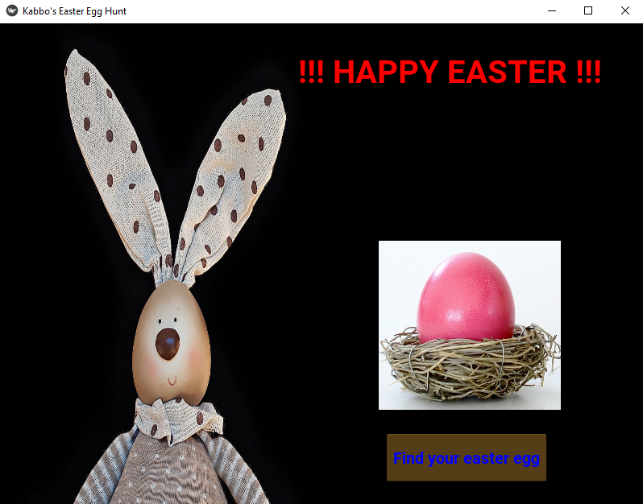

# Easter Egg Hunt -- A kivy Python Game
This is a simple picture game using Kivy and Python. You can play by clicking on the button and the game will randomly display an easter egg from a pool of three images. The game app has a nice bunny background too.

Check a screenshot of the app below
 

All the requirements to setup Kivy can be found in the requrements.txt file.

Enjoy!
